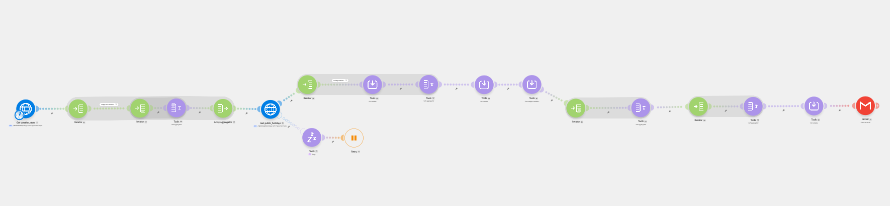
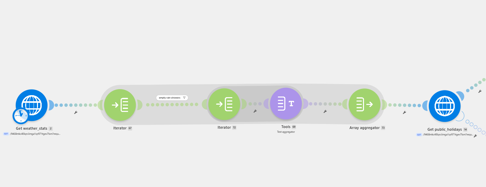
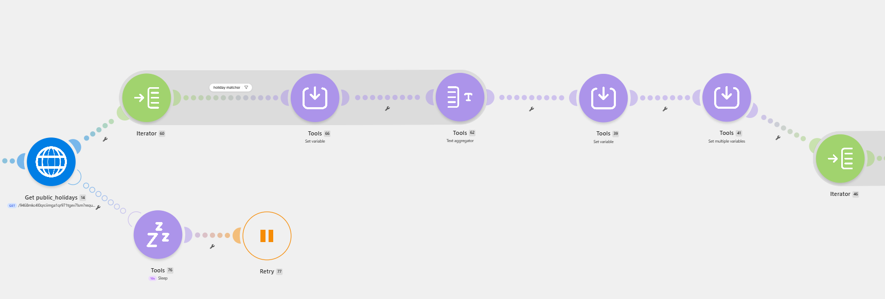
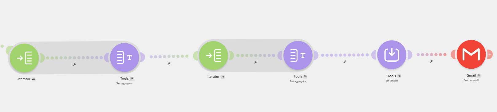

# 🌦️ Weather Report Automation

A data-driven reporting solution that brings together weather records and public holiday information, processes the datasets through multiple stages of analysis, and prepares the results as a monthly report with a JSON data file.

---

## 🎥 Demo

A complete walkthrough of the automation is available below.

[](https://www.loom.com/share/8c9ceb12cebd4affb85eb38da7c06a17)

---

## 📖 Overview

This project automates the preparation of a monthly weather report using Make.com. Weather data and public holiday information are retrieved through HTTP requests, processed through multiple transformation steps, and combined into a structured report.

The automation handles individual weather records, rain shower data, temperature calculations, weather condition analysis, public holiday matching, error handling, and JSON generation before delivering the completed report through email.

The scenario is built around dynamic data processing, allowing the report to adapt to the data received from the APIs rather than depending on a fixed set of weather conditions or hardcoded results.

---

## 🎯 Objective

The main goal of the automation is to turn raw weather and public holiday data into a complete monthly report without requiring manual data processing.

The automation covers the entire process from retrieving the source data to analyzing it, generating the required statistics, preparing the final JSON dataset, and sending the completed report by email.

---

## 🏗️ Architecture

```text
Weather API ───────────────┐
                           │
                           ▼
                    Parse JSON Data
                           │
                           ▼
                    Iterate Records
                           │
          ┌────────────────┼────────────────┐
          ▼                ▼                ▼
     Rain Showers     Temperature     Sky Conditions
      Processing        Analysis         Analysis
          │                │                │
          └────────────────┼────────────────┘
                           │
                           ▼
                  Public Holiday API
                           │
                           ▼
                    Error Handling
                           │
                           ▼
                    Date-Based Lookup
                           │
                           ▼
                    Report Generation
                           │
                ┌──────────┴──────────┐
                ▼                     ▼
          Email Report          JSON Output
```

---

## ⚙️ Automation Flow

### 📡 Weather Data Retrieval

The automation begins by retrieving the weather dataset through an HTTP request. The response is returned as JSON and contains the weather information required for the report.

The JSON response is then parsed so that the individual weather records can be processed throughout the scenario.

### 🔄 Weather Record Processing

The weather dataset is passed through an Iterator to process each record individually.

This allows the automation to work with each day's weather information separately and use the resulting bundles for calculations, filtering, lookups, and further data transformation.

### 🌧️ Rain Shower Processing

Rain shower information is handled separately because a weather record can contain multiple shower times.

The automation checks for available rain shower data, separates the individual values, and processes them before combining the results into a readable format for the final report.

### 🌡️ Temperature Analysis

Temperature values from the weather records are collected and analyzed dynamically.

The automation calculates the:

- Maximum temperature
- Minimum temperature
- Average temperature

These values are calculated from the incoming dataset rather than being manually defined.

### ☁️ Sky Condition Analysis

The automation dynamically identifies the different sky conditions present in the weather dataset.

Duplicate conditions are removed, the resulting values are sorted, and each unique condition is counted. This allows the final report to show how frequently each weather condition occurred without requiring the conditions to be defined in advance.

### 📅 Public Holiday Processing

A separate HTTP request retrieves the public holiday dataset.

The holiday information is then used alongside the weather records to identify which weather conditions occurred on public holiday dates.

### 🛡️ Error Handling

The public holiday request includes error handling for temporary API rate-limit responses.

When a `429 Too Many Requests` response occurs, the automation waits before attempting the request again. This prevents a temporary API limitation from immediately stopping the scenario.

### 🔎 Date-Based Lookup

Weather records and public holiday records are matched using their dates.

When a weather date corresponds to a public holiday, the related weather information is retrieved and included in the public holiday section of the report.

### 🧩 JSON Generation

After the weather records have been processed, the automation reconstructs the information into a structured JSON dataset.

The generated data includes relevant weather details such as:

- Sky condition
- City
- Date
- Temperature
- Public holiday status
- Rain shower times

The completed dataset is prepared as a `weather_stats.json` file for delivery with the final report.

### 📧 Report Delivery

The final results are assembled into an email containing the calculated weather statistics, weather condition analysis, rain shower information, public holiday weather information, and the generated JSON file.

The completed report is then delivered through Gmail.

---

## 🔍 Dynamic Data Processing

A key part of the automation is its use of dynamic data rather than fixed values.

For example, the sky condition analysis does not depend on a predefined list such as `Clear`, `Cloudy`, or `Rainy`. The automation identifies the conditions that actually appear in the incoming dataset and calculates their occurrence dynamically.

The same approach is used throughout the scenario for temperature statistics, rain shower information, public holiday matching, and JSON generation.

This makes the automation more adaptable to changes in the incoming data.

---

## 📊 Final Report

The completed email report contains the main results produced by the automation:

- Maximum temperature
- Minimum temperature
- Average temperature
- Sky conditions and their occurrence counts
- Rain shower times
- Weather conditions recorded on public holidays
- Generated `weather_stats.json` file

This brings the different processing stages together into a single final output.

---

## 🧠 Key Concepts Demonstrated

This project demonstrates practical use of several Make.com concepts within one automation:

- **HTTP requests** for retrieving external datasets
- **JSON parsing** for handling API responses
- **Iterators** for processing individual records and nested arrays
- **Aggregators** for combining processed values
- **Functions** for calculations and data transformation
- **Data lookups** for matching information across datasets
- **Dynamic filtering and sorting**
- **Error handling and retry logic**
- **Structured JSON generation**
- **Automated email delivery**

---

## 🛠️ Technology Stack

| Technology | Purpose |
|------------|---------|
| **Make.com** | Automation orchestration and data processing |
| **HTTP** | Retrieve weather and public holiday data |
| **JSON** | Process and structure API data |
| **Make Functions** | Calculations and data transformation |
| **Gmail** | Deliver the completed report |

---

## 📸 Workflow









---

## 💡 Project Highlights

- Dynamic processing of weather records
- Multiple Iterator and Aggregator operations
- Temperature statistics calculated from incoming data
- Dynamic identification and counting of weather conditions
- Processing of multiple rain shower values
- Public holiday and weather data matching
- API rate-limit error handling with retry logic
- Dynamic JSON data reconstruction
- Automated report generation
- JSON file attachment with the final email

---

## 👤 Author

**Muhammad Abbas**

Software Engineer • AI Automation Engineer

[](https://github.com/MdAbbas762)

[](mailto:abbas63891@gmail.com)